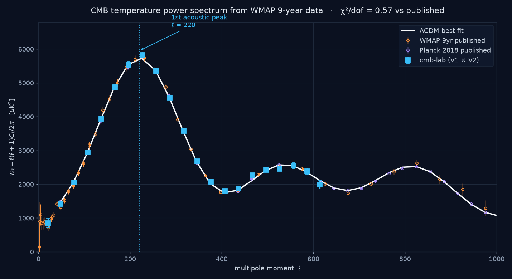
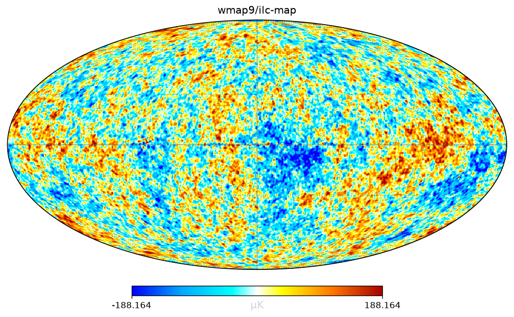
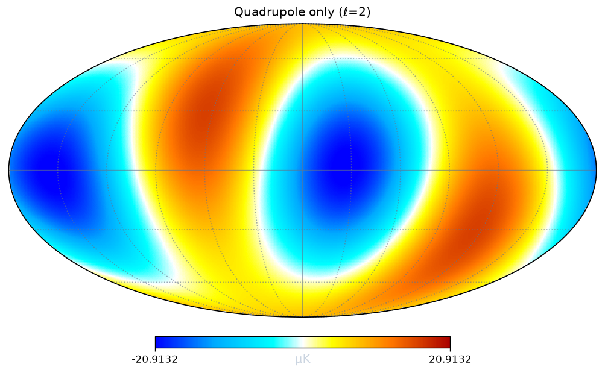
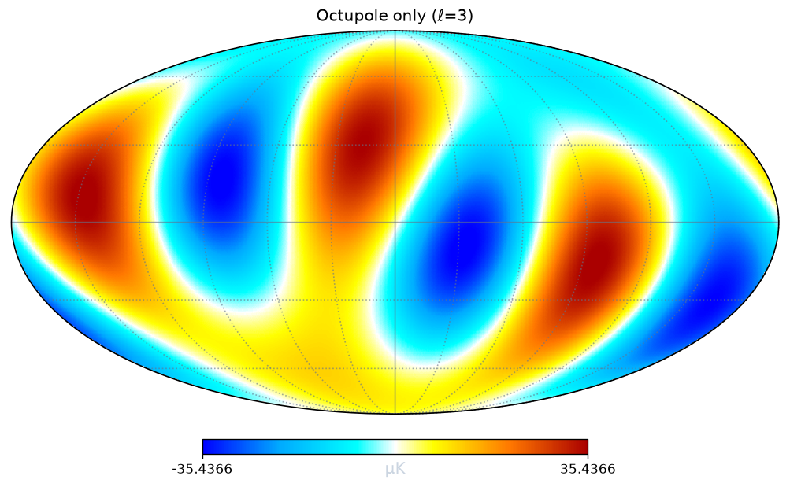
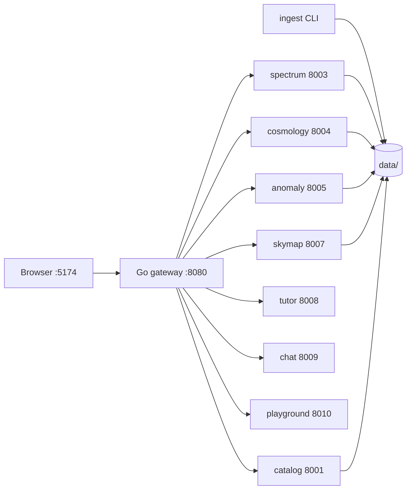

<div align="center">

# cmb-lab

**Measure the age, shape, and composition of the universe — from raw NASA data, on your laptop.**

An independent reproduction of the cosmic microwave background power spectrum, served as a
service-oriented web application with a physics teaching layer built in.

### ▶ [Try it live at 152.70.78.53](http://152.70.78.53)

<sub>No install, no sign-up. The demo runs on a free-tier VM: plain HTTP, one core, 1 GB RAM.
Browsing, the spectrum, sky maps and the lessons are quick; MCMC fits are slow.
Run it [locally](#quick-start) for the full experience.</sub>

[Quick start](#quick-start) · [What it does](#what-it-does) · [Use cases](#use-cases) ·
[Using the site](#using-the-site) · [**Textbook**](docs/textbook.md) · [Deploy it](deploy/oracle/README.md) ·
[New here?](docs/onboarding.md)



*Blue squares are this project's measurement from WMAP V1 × V2 detector maps. Orange and
purple are the published WMAP and Planck results. We did not fit to them — they are the
check, computed afterwards.*

</div>

---

## What it does

The cosmic microwave background is light released 380,000 years after the Big Bang. Its
temperature varies across the sky by about one part in 100,000, and those variations are
frozen sound waves. Measuring how loud each wavelength is tells you what the universe is
made of and what shape it has.

`cmb-lab` does that measurement from scratch:

```
NASA/ESA archive  →  clean  →  cross-spectrum  →  compare  →  fit ΛCDM  →  test anomalies
     (G1)           (G2)         (G3)            (G4)        (G5)          (G6)
```

Every stage has a **validation gate** that must pass. Nothing is taken on trust, and every
published number used as a check carries its citation.

### Results

| Gate | Assertion | Result |
| :-- | :-- | :-- |
| **G1** Ingest | SHA-256 matches the archive | ✅ |
| **G2** Clean | Monopole 2.7255 K; dipole 3362 µK toward (264°, 48°) | ✅ residual 7.9 µK |
| **G3** Spectrum | First acoustic peak at ℓ = 220 ± 8 | ✅ **ℓ = 220**, 𝒟ℓ = 5949 µK² |
| **G4** Compare | χ²/dof ≈ 1 vs published | ✅ **0.57** (WMAP), **0.87** (Planck) |
| **G5** Inference | ΛCDM parameters within 3σ of Planck 2018 | ✅ **6/6 within 3σ** |
| **G6** Anomalies | p-values calibrated against isotropic skies | ✅ mean p = 0.462 |

**Cosmological parameters we measured** (MCMC, χ²/dof = 1.067):

| Parameter | This project | Planck 2018 | Tension |
| :-- | :-- | :-- | :-- |
| H₀ | 66.38 ± 1.07 | 67.36 ± 0.54 | 0.81σ |
| Ω_b h² | 0.02170 ± 0.00035 | 0.02237 ± 0.00015 | 1.76σ |
| Ω_c h² | 0.11634 ± 0.00116 | 0.1200 ± 0.0012 | 2.19σ |
| Ω_m | 0.3136 ± 0.0116 | 0.3153 ± 0.0073 | 0.13σ |
| σ₈ | 0.7966 ± 0.0035 | 0.8111 ± 0.0060 | 2.09σ |
| Age of the universe | 14.006 ± 0.093 Gyr | 13.797 ± 0.023 | 2.19σ |

**The four famous anomalies**, calibrated against 500 simulated isotropic universes:

| Anomaly | Observed | Isotropic null | p (corrected) | Significance |
| :-- | :-- | :-- | :-- | :-- |
| Quadrupole–octupole alignment | 23.56° | 55.52 ± 22.75° | 0.366 | 0.90σ |
| Hemispherical asymmetry | 0.1774 | 0.1595 ± 0.0477 | 0.810 | 0.24σ |
| Cold Spot | −4.42σ | −3.46 ± 0.34 | 0.039 | 2.06σ |
| Low quadrupole | 65.88 µK² | 684.86 ± 445.17 | 0.047 | 1.99σ |

Nothing exceeds 2.1σ once you correct for having tested four things. That is a boring
result, and it is the correct one — which is rather the point.

---

## Use cases

**Learning the physics.** Six lessons derive everything from scratch, at three reading
depths. Start in plain English with no symbols at all; step up to equations where every
single symbol is glossed and each one comes with a high-school-physics intuition for why it
has that shape; step up again for the full algebra. 15 sections, 34 equations, 121 symbol
glosses, with audio narration.

**Teaching.** The Playground lets you break the pipeline on purpose. Turn off beam
deconvolution and watch the spectrum collapse. Turn off the noise term in the variance and
watch χ²/dof explode to 198. Each toggle reproduces a real bug from this project's history,
which is a far better lesson than being told the right answer.

**A worked reference implementation.** If you are writing your own CMB pipeline, the
[why-cross-spectra](docs/why-cross-spectra.md) note and the
[spectrum service docs](docs/services/spectrum.md) document the failure modes that cost this
project the most time — noise bias, beam deconvolution blowup, underestimated error bars,
unresolved point sources.

**A portfolio project.** Nine services, two languages, real data, real validation, honest
limitations.

---

## Quick start

**Requirements:** Python 3.12, Node 20+, ~2 GB disk. Go is downloaded into the repo
automatically — you do not need it installed.

> Python **3.12 specifically** — healpy and camb do not yet ship wheels for 3.13+.

| Platform | How |
| :-- | :-- |
| **macOS** (Intel or Apple Silicon) | Natively, below |
| **Linux** (x86-64 or ARM) | Natively, below |
| **Windows** | `.\scripts\dev.ps1 up` — runs itself in Docker or WSL, see [Windows](#windows) |

```bash
git clone https://github.com/spaceman-dev/cmb-lab.git
cd cmb-lab

make setup            # venv + every package
make toolchain        # fetch Go for this OS/arch
make build            # gateway binary + frontend
make data-bootstrap   # ~170 MB from NASA LAMBDA and ESA. No API key, no account

./scripts/dev.sh up   # start all 9 services
```

Then open **http://localhost:5174**.

Everything is driven by [scripts/dev.py](scripts/dev.py), which behaves identically on every
platform — `setup`, `toolchain`, `build`, `up`, `down`, `restart`, `status`, `logs`, `doctor`.
`scripts/dev.sh` and `scripts/dev.ps1` are thin wrappers around it, so there is only one
implementation to keep correct. `make` is a convenience, never a requirement.

```bash
python scripts/dev.py doctor     # check this machine has what it needs
python scripts/dev.py status     # health table for all 9 services
python scripts/dev.py logs chat  # follow one service
```

Logs land in `data/logs/`.

### Windows

Clone the repo and run one command. Everything — build, data download, all nine services —
is handled for you:

```powershell
git clone https://github.com/spaceman-dev/cmb-lab.git
cd cmb-lab
.\scripts\dev.ps1 up
```

Then open **http://localhost:7860**. That is the whole setup. You do not need Python, Node
or Go on Windows — only Docker.

```powershell
.\scripts\dev.ps1 status     # is it up?
.\scripts\dev.ps1 logs       # follow the logs
.\scripts\dev.ps1 down       # stop it
.\scripts\dev.ps1 up -Backend wsl   # use WSL instead of Docker
```

**Why not natively?** [healpy has no Windows build](https://pypi.org/project/healpy/) — no
wheels, and upstream states plainly that *"healpy does not currently support Windows."* It
performs every spherical-harmonic transform here, so `spectrum`, `anomaly`, `skymap` and
`tutor` cannot run without it. Everything else (`camb`, `astropy`, `numpy`, `scipy`) has
Windows wheels; healpy alone is the blocker. So the tooling runs the stack in Linux for you
rather than failing halfway through a `pip install`.

| Backend | Default | Needs | Notes |
| :-- | :-- | :-- | :-- |
| **Docker** | ✅ | Docker Desktop | Nothing else to install. One container, one port |
| **WSL2** | `-Backend wsl` | `wsl --install -d Ubuntu` | Native speed, full dev loop, editable installs |

The choice is automatic: Docker if it is running, otherwise WSL if a distro exists, otherwise
a message telling you how to get one. Override any time with `-Backend docker|wsl`, or set
`CMBLAB_BACKEND` in the environment.

The first `up` builds the image and downloads ~170 MB of archive data, so it takes a while.
The data is kept in a Docker volume, so later starts are quick.

**If you prefer WSL** (recommended for actually developing — you get editable installs and
fast rebuilds):

```powershell
wsl --install -d Ubuntu     # then reboot and open Ubuntu
```

```bash
sudo apt update && sudo apt install -y python3.12 python3.12-venv build-essential
# then follow the macOS/Linux instructions above, unchanged
```

### Optional: the AI assistant

The built-in assistant works with **no API key** — 29 curated questions, a glossary, lesson
retrieval, and your live pipeline numbers. To also allow open-ended questions:

```bash
# .env
GEMINI_API_KEY=your_key_here     # free at https://aistudio.google.com/apikey
```

then `./scripts/dev.sh restart`. If the key is missing, invalid, rate-limited, or the model
is retired, the assistant silently falls back to curated answers and tells you why.

---

## Using the site

<table>
<tr><td width="50%">

### Spectrum
Pick two WMAP detector maps, press **Recompute**. Watch the acoustic peaks appear and gates
G3/G4 turn green. Try V1 × V2, then W1 × W2 — independent detectors, same answer.

</td><td width="50%">

### Sky Map
The actual microwave sky in four projections. Filter by multipole band: view the quadrupole
and octupole alone and the alignment anomaly is visible by eye.

</td></tr>
<tr><td>

### Inference
Start an MCMC run. Watch walkers explore the posterior and the parameter table fill in with
values and tensions against Planck 2018.

</td><td>

### Anomalies
Measure all four, then launch the Monte Carlo calibration. The raw and corrected p-values
are shown side by side so the look-elsewhere effect is visible.

</td></tr>
<tr><td>

### Playground
Twelve knobs. Change H₀ and watch the peaks slide. Disable point-source subtraction and
watch the residual grow as ℓ². Eight guided experiments with questions and answers.

</td><td>

### Learn
Six lessons, three depths, audio narration, and live values from *your* run spliced into the
prose. Ask the assistant anything at any point. For the full derivations, read the
[textbook](docs/textbook.md).

</td></tr>
</table>

<div align="center">

| The microwave sky | Quadrupole (ℓ=2) | Octupole (ℓ=3) |
| :-: | :-: | :-: |
|  |  |  |

</div>

---

## Architecture

A Go gateway in front of eight Python services and a React frontend.



Each service owns one stage and nothing else. They never call each other over HTTP; shared
state lives on disk. Full reference: **[docs/services/](docs/services/README.md)**.

| Service | Port | Does |
| :-- | :-- | :-- |
| [gateway](docs/services/gateway.md) | 8080 | Routing, caching, rate limiting, health |
| [ingest](docs/services/ingest.md) | CLI | Download + verify + clean archive data |
| [catalog](docs/services/catalog.md) | 8001 | What data exists locally |
| [spectrum](docs/services/spectrum.md) | 8003 | Power spectrum estimation |
| [cosmology](docs/services/cosmology.md) | 8004 | CAMB + MCMC parameter fitting |
| [anomaly](docs/services/anomaly.md) | 8005 | Anomaly statistics + Monte Carlo |
| [skymap](docs/services/skymap.md) | 8007 | Map rendering and filtering |
| [tutor](docs/services/tutor.md) | 8008 | Curriculum, audio, glossary |
| [chat](docs/services/chat.md) | 8009 | Grounded question answering |
| [playground](docs/services/playground.md) | 8010 | Interactive experiments |
| [web](docs/services/web.md) | 5174 | React frontend |

**Stack:** Python 3.12 · FastAPI · healpy · astropy · numpy · scipy · CAMB · emcee ·
Go 1.22 · React 18 · TypeScript · Vite · Plotly · KaTeX

---

## The one idea that makes it work

Our first attempt put the first peak at ℓ = 343 with χ²/dof = **1669**. No peaks — just a
wall of noise climbing off the top of the plot.

The cause: an auto-spectrum squares a map, so it squares the *noise* along with the signal.
Deconvolving the beam then divides by an exponentially small number, amplifying that noise
exponentially. At ℓ = 350 it overestimated the power by 26×.

The fix is to correlate **two different detectors** that saw the same sky with independent
noise:

$$\langle a^A_{\ell m} a^{B*}_{\ell m}\rangle = C_\ell B^A_\ell B^B_\ell + \underbrace{\langle n^A n^{B*}\rangle}_{=\,0}$$

The noise term vanishes because uncorrelated things have zero expected product. No noise
model, no instrument simulation — just arithmetic. χ²/dof went from 1669 to 1.02.

Full story: [docs/why-cross-spectra.md](docs/why-cross-spectra.md).

---

## Documentation

### 📖 The textbook

**[docs/textbook.md](docs/textbook.md)** — a self-contained course on the physics behind this
project, written for someone meeting it for the first time. It starts from high-school algebra
and builds to a measured cosmology, so you should not need to open another book.

The Friedmann equation is derived from high-school energy conservation, not general relativity.
The acoustic peaks come out of a mass on a spring. Spherical harmonics are motivated from
ordinary Fourier series. Every number in it — $\ell = 220$, $\chi^2/\mathrm{dof} = 0.57$,
$f_\mathrm{sky} = 0.688$ — is one this project actually measured, and every place the method
cuts a corner is flagged rather than hidden.

8 parts · 33 chapters · 31 exercises with worked solutions · symbol and constant tables.

| Part | Covers |
| :-- | :-- |
| 0 · Toolkit | Units, calculus, Fourier, $\chi^2$ — skip if familiar |
| I · Expanding universe | Friedmann from Newton, thermal history, recombination |
| II · Sound | The plasma as a harmonic oscillator; why the peak is at $\ell = 220$ |
| III · Statistics of a sky | Spherical harmonics, $C_\ell$, $\mathcal{D}_\ell$, cosmic variance |
| IV · The measurement | Masks, beams, noise, and the cross-spectrum trick |
| V · Cosmology | CAMB, the six parameters, MCMC, the Hubble tension |
| VI · Anomalies | The four claims, and the look-elsewhere effect |
| VII · Pipeline | The six gates mapped to the physics |

### Reference

| Document | For |
| :-- | :-- |
| **[Textbook](docs/textbook.md)** | **The physics, from scratch.** Graduate course in one file |
| **[Onboarding](docs/onboarding.md)** | **New here? Start with this.** Physics from zero, then the codebase |
| [Oracle Cloud deployment](deploy/oracle/README.md) | Scripted deploy to Oracle's Always Free tier |
| [Deployment options](docs/deployment.md) | Every hosting route, including free static hosting |
| [Services](docs/services/README.md) | Per-service reference, all 11 |
| [Architecture](docs/architecture.md) | Design decisions |
| [Data sources](docs/data-sources.md) | Every archive file, with URLs |
| [Why cross-spectra](docs/why-cross-spectra.md) | The central methodological choice |

---

## Development

```bash
make test              # 100+ pytest tests
make test-physics      # physics-marked tests only
make lint              # ruff + go vet + tsc
make fmt

make dev-spectrum      # one service, autoreload
./scripts/dev.sh logs spectrum
npm --prefix web run typecheck
```

---

## Limitations

Stated plainly, because a result without its caveats is not a result.

- **Diagonal covariance.** Masking couples neighbouring bandpowers; we ignore the
  off-diagonal terms, so our error bars are slightly optimistic.
- **f_sky approximation, not full MASTER.** We do not invert the mode-coupling matrix. This
  is accurate for broad features but degrades at the lowest bandpower (ℓ ≈ 21).
- **τ is a prior, not a measurement.** Temperature data alone cannot break the τ–A_s
  degeneracy. We adopt the published value and say so.
- **Point-source fit is mildly circular by default.** `fit_against_theory` fits the
  amplitude against a ΛCDM curve. A non-circular alternative using frequency dependence
  exists but is not the default.
- **ℓ ≲ 700.** Set by WMAP's beam and noise, not by the code.
- **TT only.** No polarisation.
- **Audio narration needs macOS** (`say`/`afconvert`). Elsewhere the browser's speech
  synthesis takes over automatically.
- **No native Windows**, because healpy has no Windows build. WSL2 and Docker both work
  fully — see [Windows](#windows).

---

## Credits

Data from [NASA LAMBDA](https://lambda.gsfc.nasa.gov/) (WMAP 9-year) and the
[ESA Planck Legacy Archive](https://pla.esac.esa.int/) (PR3). Theory spectra from
[CAMB](https://camb.info/); sampling with [emcee](https://emcee.readthedocs.io/);
sphere operations with [healpy](https://healpy.readthedocs.io/).

This project reproduces published science independently. It is not affiliated with NASA or
ESA, and the published results are used only as a check — never as an input.

## License

MIT — see [LICENSE](LICENSE).
