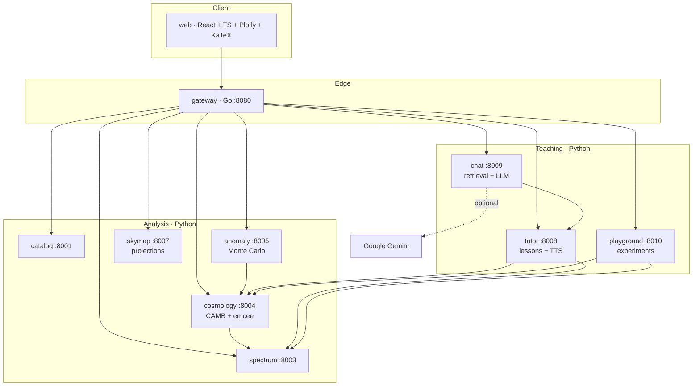

# Architecture — Phase 2 services

Extends [architecture.md](architecture.md) with the services added for validation gates G5
and G6, the teaching layer, and the interactive tools.

---

## Service topology

Dependencies flow one way. `anomaly` depends on `cosmology` because the null hypothesis it
tests against *is* ΛCDM — the simulations have to be drawn from the theory spectrum.

---

## cosmology — gate G5

| Module | Responsibility |
|---|---|
| `theory.py` | CAMB wrapper with an LRU cache. One evaluation ≈ 60 ms at ℓmax=700. |
| `likelihood.py` | Gaussian bandpower likelihood, prior box, τ prior |
| `sampler.py` | `emcee` ensemble sampler across a process pool; fast 1-D χ² scans |
| `pipeline.py` | Orchestration and the G5 tension check |

**Measured result** (WMAP V1×V2, 20 walkers × 500 steps, free: H₀, Ω_b h², Ω_c h²):

| Parameter | Ours | Planck 2018 | Tension |
|---|---|---|---|
| H₀ | 66.38 ± 1.07 | 67.36 ± 0.54 | 0.81σ |
| Ω_b h² | 0.02170 ± 0.00035 | 0.02237 ± 0.00015 | 1.76σ |
| Ω_c h² | 0.11634 ± 0.00116 | 0.1200 ± 0.0012 | 2.19σ |
| Ω_m | 0.3136 ± 0.0116 | 0.3153 ± 0.0073 | 0.13σ |
| σ₈ | 0.7966 ± 0.0035 | 0.8111 ± 0.0060 | 2.09σ |
| Age | 14.006 ± 0.093 Gyr | 13.797 ± 0.023 | 2.19σ |

χ²/dof = 1.067. **6/6 parameters within 3σ → G5 PASS.**

### Honest limitations

* The bandpower covariance is treated as **diagonal**. Masking couples neighbouring
  bandpowers, so the real covariance has off-diagonal terms. Our error bars are therefore
  slightly optimistic, which is the most likely reason several parameters sit near 2σ.
* **τ is fixed** to the published value with a Gaussian prior. TT data alone cannot separate
  it from A_s, because reionization suppresses the spectrum by e^(−2τ) at every multipole we
  measure. Only large-scale polarization breaks that degeneracy.
* Only ℓ ≥ 30 is used. Below that the f_sky approximation is least reliable.

---

## anomaly — gate G6

| Module | Responsibility |
|---|---|
| `statistics.py` | The four isotropy statistics |
| `simulations.py` | Parallel Monte Carlo null distributions, Šidák correction |
| `pipeline.py` | Orchestration, and the G6 calibration test |

### What G6 actually asserts

G6 is **not** "the anomalies are real". No test suite can assert that. G6 asserts that the
p-value machinery is unbiased:

> Feed the pipeline skies that are isotropic by construction. The resulting p-values must be
> uniformly distributed on [0,1]. A pipeline that reports p = 0.01 for an ordinary sky is
> broken — and that is the single most common failure mode in anomaly hunting.

### Three sources of false significance, and how each is handled

| Problem | Handling |
|---|---|
| **Search over axes.** Maximising over thousands of directions produces extremes even under the null. | Every simulated sky runs the **identical** search. |
| **Quoting the best of several tests.** Four statistics means four chances. | Šidák: p_corr = 1 − (1−p)ⁿ, n = 4. |
| **Choosing the statistic after seeing the data.** | Not fixable after the fact — only declarable. The API labels raw vs corrected explicitly. |

### Measured result (WMAP 9-year ILC, N_side 64, KQ75 mask, 500 isotropic ΛCDM simulations)

| Statistic | Observed | Isotropic null | p (raw) | p (corrected) | σ |
|---|---|---|---|---|---|
| Quadrupole–octupole alignment | 23.6° | 55.5 ± 22.7° | 0.108 | 0.366 | 0.90 |
| Hemispherical power asymmetry | 0.177 | 0.160 ± 0.048 | 0.339 | 0.810 | 0.24 |
| Cold Spot | −4.42σ | −3.46 ± 0.34 | 0.010 | **0.039** | 2.06 |
| Low quadrupole | 65.9 µK² | 685 ± 445 µK² | 0.012 | **0.047** | 1.99 |

**Calibration (G6):** mean p = 0.462 on isotropic input, expected 0.5; 0% of p-values below
0.05, expected 5%. **PASS.**

### Reading this table honestly

Two things are worth noticing, and both are the point of the exercise.

**The look-elsewhere correction matters.** The Cold Spot moves from p = 0.010 — which sounds
like a 2.6σ detection — to p = 0.039 once you account for having tested four statistics.
Same data, same measurement, four times less impressive. Quoting the raw number would have
been misleading.

**Our alignment result is weaker than the literature's.** Published analyses report ~10° and
p ≈ 0.01; we get 23.6° and p = 0.37. That is not a contradiction, it is a consequence of
running the analysis at N_side 64 through a Galactic mask with a coarse axis grid. The mask
couples multipoles and broadens the null distribution, so the same sky looks less unusual.
A fairer comparison would use a full-sky component-separated map and a finer grid. The
pipeline supports both; the defaults here favour speed.

The isotropic mean of 55.5° is itself a useful check: statistical isotropy predicts a mean
angle of 60° for two unrelated axes, and that is what the simulations produce.

### Performance note

The quadrupole–octupole axis search originally took 11.2 s per sky, which made a
1000-realisation Monte Carlo impractical. Two observations cut it to 1.6 s:

1. An axis is **headless** — n and −n give an identical dispersion — so only the northern
   hemisphere needs searching.
2. The dispersion is **smooth** in direction, so a coarse grid (N_side 8) followed by local
   refinement beats a single fine grid at equal accuracy.

Result is unchanged to within grid resolution (22.5° → 23.6°).

### A note on absolute values

Masking suppresses low-ℓ power badly — the f_sky approximation is at its worst at ℓ=2. Our
measured C₂ is therefore well below the ΛCDM value in absolute terms. **This does not
invalidate the p-value**, because the simulations are masked identically. That is precisely
why the Monte Carlo approach is used rather than comparing to a theory number directly.

---

## skymap

Renders the same data in five ways, and filters by multipole band.

| Projection | Property | Use |
|---|---|---|
| Mollweide | equal area | the CMB standard |
| Orthographic | globe from outside | showing a direction |
| Gnomonic | tangent-plane zoom | inspecting the Cold Spot |
| Cartesian | lon/lat rectangle | reading off coordinates |
| 3D sphere | no projection | interactive exploration |

The multipole presets are the pedagogically valuable part: rendering ℓ=2 alone, then ℓ=3
alone, then their sum, makes the quadrupole–octupole alignment **visible** rather than
merely tabulated.

---

## tutor

Six lessons, fifteen sections, every derivation the project relies on.

* `content.py` — narrative, equations, numbered derivation steps, and a plain-text
  `narration` field for speech
* `audio.py` — local TTS via macOS `say` + `afconvert`, content-addressed and cached.
  Falls back to the browser SpeechSynthesis API when unavailable.
* `live.py` — resolves `live` keys against the running pipeline, so a lesson can say
  "here is what *your* analysis measured"
* `glossary.py` — 18 terms, also the knowledge base for the chat assistant

---

## chat — two stages

**Stage 1 (always on).** Intent matching → live measurements → glossary → lesson retrieval.
It never invents a number: every figure comes from a resolver reading the actual pipeline.

**Stage 2 (optional).** With `GEMINI_API_KEY` set, retrieval still runs first and its output
becomes grounding context for the model, with an explicit instruction not to state any
number outside that context. If the model call fails for any reason, the stage-1 answer is
returned — the assistant never goes dark.

---

## playground

Eight curated before/after experiments plus a free-form parameter sandbox. Each knob carries
both the physics behind it and what to watch for. The best experiments break the result:

| Experiment | What it teaches |
|---|---|
| Use one detector instead of two | Noise bias, and why cross-spectra exist |
| Turn off point source subtraction | χ²/dof goes 1 → 32 |
| Remove the Galactic mask | Foregrounds bury the acoustic peaks |
| V band vs W band | Independent frequencies agree → it is cosmological |
| Set H₀ = 73 | The Hubble tension, seen from the CMB side |
| Drop Ω_c h² | You cannot fit this spectrum without dark matter |

---

## Gate summary

| Gate | Assertion | Status |
|---|---|---|
| G1 · Ingest | Downloads verified by SHA-256 | pass |
| G2 · Clean | Monopole 2.7255 K, dipole 3362 µK toward (264°, 48°) | pass |
| G3 · Spectrum | First acoustic peak at ℓ = 220 ± 8 | pass |
| G4 · Compare | χ²/dof ≈ 1 vs published WMAP and Planck TT | pass |
| G5 · Inference | ΛCDM parameters within 3σ of Planck 2018 | pass |
| G6 · Anomaly | p-values calibrated on isotropic input | pass |
