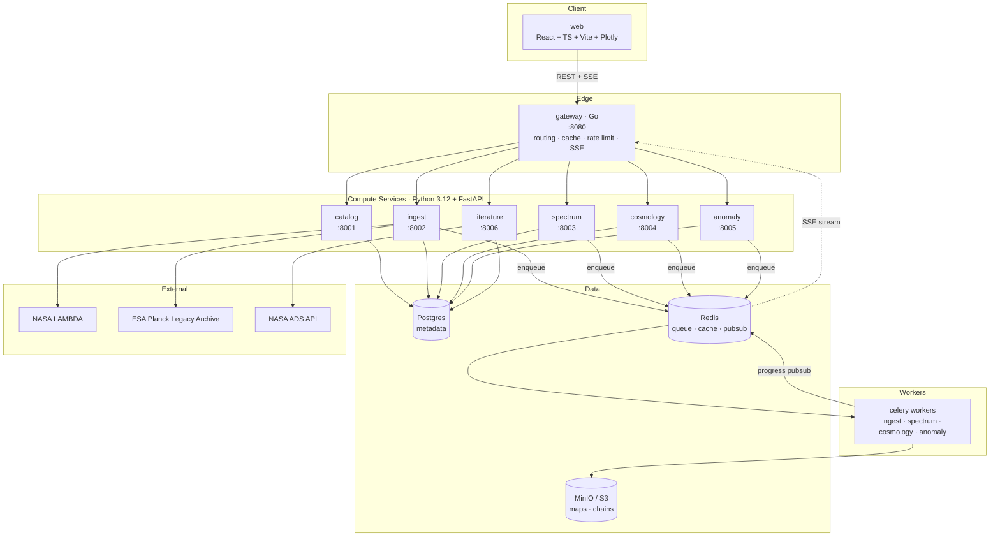
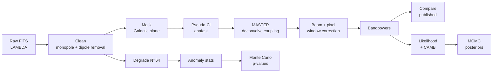

# cmb-lab — Architecture Plan

An independent reproduction pipeline for Cosmic Microwave Background analysis, exposed as a
service-oriented web application.

**Thesis question:** Can we independently re-derive the CMB angular power spectrum and ΛCDM
parameters from raw NASA sky maps, and do the large-angle "anomalies" survive a rigorous
Monte Carlo significance test?

---

## 1. Design principles

| Principle | Consequence |
|---|---|
| **Every number is reproducible** | Each result row stores its full provenance chain back to a checksummed source file. |
| **Physics is testable** | Regression tests assert published values (first peak at ℓ≈220, T₀=2.7255 K). A refactor that breaks physics fails CI. |
| **Services own their data** | No shared tables. Cross-service reads go through HTTP APIs, never direct SQL. |
| **Compute is asynchronous** | Nothing that takes >2 s happens in a request cycle. Everything heavy is a job. |
| **Big data stays out of the DB** | Postgres holds metadata only. Sky maps and MCMC chains live in object storage. |

---

## 2. Service topology



---

## 3. Service responsibilities

Each service is an independently deployable container with its own FastAPI app, its own
Postgres schema, and its own Celery queue.

### `gateway` — Go, port 8080
The only publicly exposed process.
- Reverse-proxies `/api/v1/*` to the correct backend service
- Response caching in Redis (spectra and theory curves are expensive and immutable)
- Token-bucket rate limiting per IP
- Server-Sent Events endpoint that bridges Redis pubsub → browser for live job progress
- CORS, request IDs, structured access logs
- **Why Go:** SSE fan-out and cache-hit serving are concurrency problems, not physics problems.

### `catalog` — Python, port 8001
System of record for *what data exists*.
- `datasets` (WMAP 9-year, Planck 2018, ACT DR6)
- `products` (maps, masks, beam transfer functions, published spectra) with URL + checksum
- `map_artifacts` — cleaned, derived maps
- `jobs` — job lifecycle for every service
- Provenance graph: any artifact can be traced to its source products and operations

### `ingest` — Python, port 8002 + worker
Acquisition and cleaning. **Steps 4 and 5 of the build plan live here.**
- Resumable, checksum-verified downloads from LAMBDA / PLA / IRSA
- FITS → HEALPix array decoding
- Cleaning pipeline: unit normalization (K → μK), `UNSEEN` handling, monopole + dipole removal,
  Galactic mask application, `ud_grade` degrading
- Writes cleaned maps to MinIO as compressed `.npz`; registers artifact in `catalog`

### `spectrum` — Python, port 8003 + worker
Angular power spectrum estimation.
- Pseudo-$C_\ell$ via `healpy.anafast`
- MASTER algorithm: mode-coupling matrix deconvolution for masked skies (`pymaster`)
- Beam transfer function and pixel window deconvolution
- Bandpower binning, covariance from Monte Carlo
- Comparison endpoint: your bandpowers vs. published Planck spectra, with χ²/dof

### `cosmology` — Python, port 8004 + worker
Theory and inference.
- CAMB: ΛCDM parameters → theory $C_\ell$
- Likelihood against `plik_lite` (foreground-marginalized)
- `emcee` MCMC; chains written to MinIO, posterior summaries to Postgres
- Derived parameters ($H_0$, $\Omega_m$, $\sigma_8$, age)

### `anomaly` — Python, port 8005 + worker
The research contribution.
- Quadrupole–octupole alignment (multipole vectors, angular momentum dispersion)
- Hemispherical power asymmetry (dipole modulation fit)
- Cold Spot (spherical Mexican-hat wavelets)
- Low quadrupole $C_2$ deficit
- Monte Carlo engine: N Gaussian isotropic realizations at N_side=64, parallel across 14 cores
- Empirical p-values **plus** look-elsewhere correction

### `literature` — Python, port 8006
- NASA ADS + arXiv harvesting
- Extracted published parameter values with uncertainties
- Powers the "tension dashboard" — your posterior against the literature distribution

---

## 4. Data architecture

### Postgres — metadata only
Schema-per-service, no cross-schema foreign keys.

```
catalog.datasets          catalog.products        catalog.map_artifacts
catalog.jobs              catalog.provenance_edges
spectrum.spectrum_results spectrum.bandpowers
cosmology.theory_runs     cosmology.inference_runs   cosmology.posterior_summaries
anomaly.anomaly_results   anomaly.simulation_batches
literature.papers         literature.published_values
```

### MinIO — bulk binary
```
raw/{dataset}/{product_id}/{filename}.fits       immutable source downloads
clean/{artifact_id}/map.npz                      cleaned HEALPix arrays
spectra/{result_id}/bandpowers.parquet
chains/{run_id}/chain.npz                        MCMC samples
sims/{batch_id}/statistics.parquet               Monte Carlo outputs
previews/{artifact_id}/mollweide.png
```

### Redis
Celery broker/backend, gateway response cache, job-progress pubsub channels.

---

## 5. Public API surface

```
GET    /api/v1/health

# Catalog
GET    /api/v1/datasets
GET    /api/v1/datasets/{slug}/products
GET    /api/v1/maps
GET    /api/v1/maps/{id}
GET    /api/v1/maps/{id}/stats           monopole, dipole amplitude + direction
GET    /api/v1/maps/{id}/preview.png     Mollweide projection

# Ingest
POST   /api/v1/ingest/jobs               { dataset, product, clean_ops[] }

# Spectrum
POST   /api/v1/spectra/jobs              { map_id, mask_id, method, lmax, binning }
GET    /api/v1/spectra/{id}
GET    /api/v1/spectra/{id}/bandpowers
GET    /api/v1/spectra/{id}/compare      vs published -> residuals + chi2/dof
GET    /api/v1/spectra/reference         published Planck/WMAP spectra

# Cosmology
POST   /api/v1/theory/spectra            { H0, ombh2, omch2, ns, As, tau, lmax }
POST   /api/v1/inference/runs            { spectrum_id, params[], nwalkers, nsteps }
GET    /api/v1/inference/{id}/posterior

# Anomaly
POST   /api/v1/anomaly/jobs              { map_id, statistic, n_sims }
GET    /api/v1/anomaly/{id}

# Literature
GET    /api/v1/literature/params/{param}
GET    /api/v1/literature/tension/{param}

# Jobs
GET    /api/v1/jobs/{id}
GET    /api/v1/jobs/{id}/events          SSE progress stream
```

---

## 6. Physics pipeline and validation gates

Every stage has a published number it must reproduce. These become `pytest` assertions.



| Gate | Assertion |
|---|---|
| G1 · Ingest | Downloaded file matches published checksum |
| G2 · Clean | Monopole $T_0 = 2.7255$ K; dipole $\approx 3.362$ mK toward $(l,b) \approx (264°, 48°)$ |
| G3 · Spectrum | First acoustic peak at $\ell = 220 \pm 5$, $\mathcal{D}_\ell \approx 5750\ \mu K^2$; peaks 2 and 3 near $\ell \approx 540, 800$ |
| G4 · Compare | $\chi^2/\mathrm{dof} \approx 1$ against published Planck TT |
| G5 · Inference | Recover $H_0 = 67.36 \pm 0.54$, $\Omega_m = 0.3153$, $n_s = 0.9649$, $\sigma_8 = 0.8111$ |
| G6 · Anomaly | Monte Carlo p-values consistent with published isotropy analyses |

---

## 7. Repository layout

```
cmb-lab/
├── docs/
│   ├── architecture.md          this file
│   └── data-sources.md          where to download everything (Step 4)
├── libs/
│   └── cmblab-core/             shared Python package
│       └── src/cmblab_core/
│           ├── config.py        env-driven settings
│           ├── models/          pydantic domain models
│           ├── storage/         Postgres, MinIO, Redis clients
│           ├── healpix/         map I/O, cleaning, masking ops
│           ├── jobs/            Celery app, progress reporting
│           └── telemetry/       structured logging
├── services/
│   ├── gateway/                 Go
│   ├── catalog/                 Python
│   ├── ingest/                  Python
│   ├── spectrum/                Python
│   ├── cosmology/               Python
│   ├── anomaly/                 Python
│   └── literature/              Python
├── web/                         React + TS + Vite + Plotly
├── infra/
│   ├── docker-compose.yml
│   └── migrations/              SQL schema migrations
├── data/                        gitignored local cache
└── Makefile
```

---

## 8. Build order

| Phase | Deliverable | Status |
|---|---|---|
| 0 | Repo scaffold, Docker Compose, shared core lib | done |
| 1 | `catalog` — dataset and product registry | done |
| 2 | `ingest` — download + clean + store (Steps 4, 5) | done, gate G2 passing |
| 3 | `spectrum` — the physics payoff (Step 6) | done, gates G3 + G4 passing |
| 4 | `gateway` + API contract (Step 7) | done |
| 5 | `web` — spectrum viewer + sky map (Step 8) | done |
| 6 | `cosmology` — CAMB + MCMC | not started |
| 7 | `anomaly` — the thesis contribution | not started |
| 8 | `literature` — tension dashboard | not started |

### Measured results

| Quantity | Our value | Published | Agreement |
|---|---|---|---|
| CMB monopole (synthetic gate) | 2.7255 K | 2.72548 K | exact |
| Residual dipole, WMAP ILC | 7.9 µK | pre-subtracted | within 50 µK tolerance |
| KQ75 sky fraction | 0.688 | ~0.69 | matches |
| First acoustic peak, V1×V2 | ℓ = 220, 𝒟ℓ = 5949 µK² | ℓ ≈ 220, 𝒟ℓ ≈ 5750 µK² | within tolerance |
| First acoustic peak, W1×W2 | ℓ = 218, 𝒟ℓ = 5901 µK² | as above | independent confirmation |
| χ²/dof vs WMAP 9-year TT | 0.57 | — | consistent |
| χ²/dof vs Planck 2018 TT | 0.87 | — | consistent |
| Point source amplitude | 1.45×10⁻² µK²·sr | — | required for agreement |

---

## 9. Environment constraints

- **Python 3.12 pinned.** Python 3.14 is installed but `healpy`, `camb`, and `pymaster` lack
  reliable arm64 wheels for it. All Python services use 3.12.
- **Apple Silicon:** `pymaster` needs `libsharp`/`gsl` via Homebrew; `healpy` ships arm64 wheels.
- **14 cores / 24 GB RAM:** Monte Carlo runs parallelize to 12 workers. Full-resolution Planck
  maps (N_side=2048, ~50M pixels) fit in RAM one at a time — degrade to N_side=64 for simulations.
- **Disk:** ~309 GB free. WMAP 9-year full set is ~2 GB; Planck 2018 component-separated maps
  ~1 GB each. Budget 50 GB.
