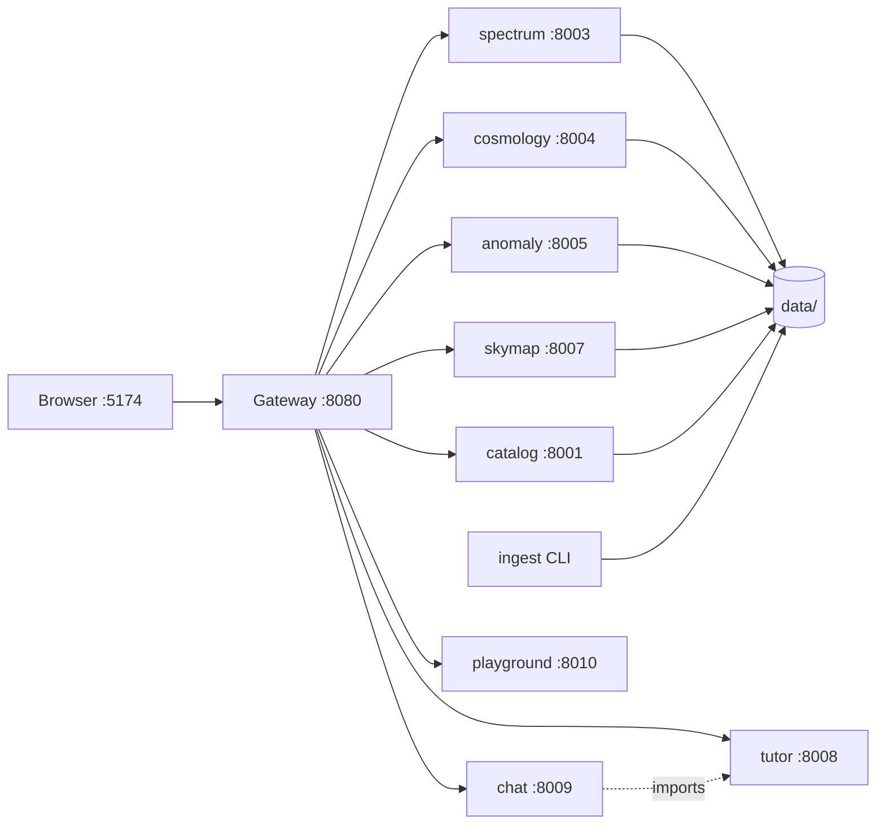

# Service reference

`cmb-lab` is nine services: one Go gateway, eight Python (FastAPI) services, and a React
frontend. Each service owns one stage of the pipeline and nothing else.

| Service | Port | Language | Responsibility |
| --- | --- | --- | --- |
| [gateway](gateway.md) | 8080 | Go | Single public entry point, caching, rate limiting |
| [ingest](ingest.md) | — (CLI) | Python | Download and verify NASA/ESA archive files |
| [catalog](catalog.md) | 8001 | Python | Inventory of local data, map previews |
| [spectrum](spectrum.md) | 8003 | Python | Power spectrum estimation (gates G3, G4) |
| [cosmology](cosmology.md) | 8004 | Python | Theory spectra and MCMC fitting (gate G5) |
| [anomaly](anomaly.md) | 8005 | Python | Large-angle anomaly statistics (gate G6) |
| [skymap](skymap.md) | 8007 | Python | Sky map rendering and filtering |
| [tutor](tutor.md) | 8008 | Python | Physics curriculum, audio, glossary |
| [chat](chat.md) | 8009 | Python | Grounded question answering |
| [playground](playground.md) | 8010 | Python | Interactive parameter experiments |
| [web](web.md) | 5174 | TypeScript | React frontend |

## Shared foundations

Everything Python-side imports [`cmblab_core`](core.md), which provides the FastAPI app
factory, settings, HEALPix I/O and cleaning, the job manager, and the TLS trust-store fix.

## Request flow



The browser never talks to a Python service directly. Services never call each other over
HTTP either — the one cross-service dependency is `chat` importing `tutor`'s glossary and
live-value resolvers as a Python library, which is deliberate: it keeps answers grounded
without adding a network hop.

## Conventions every service follows

- Built with `cmblab_core.service.create_app()`, so all of them get `/health`, CORS,
  request-ID propagation, and consistent error mapping for free.
- `FileNotFoundError` → 404, `KeyError` → 404, `ValueError` → 400. Services raise ordinary
  Python exceptions and let the handler do the translation.
- Long jobs (MCMC, Monte Carlo) go through `cmblab_core.jobs.JobManager` and return a job
  id immediately rather than blocking the request.
- No service owns another service's data. Shared state lives on disk under `data/`.

## Running services

```bash
./scripts/dev.sh up        # start everything
./scripts/dev.sh status    # health table
./scripts/dev.sh logs spectrum
./scripts/dev.sh restart   # after changing .env
make dev-spectrum          # run one service in the foreground, with reload
```

Logs are written to `data/logs/<service>.log`.
